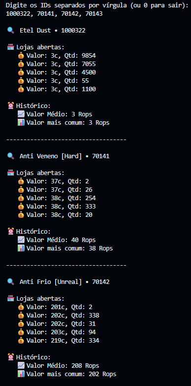

# HRStoreHelper (History Reborn Store Helper)

This project is a tool for analyzing data from [History Reborn](https://historyreborn.net/) market using scraping techniques. The goal is to share insights and allow the community to contribute improvements while keeping the software open.

## License

This project is licensed under the **GNU Affero General Public License v3 (AGPLv3)**. See the LICENSE file for details.

**Important Notes:**
- By using or contributing to this project, you agree to the terms of the AGPLv3.
- Contributions are welcome, but the license ensures that all modifications remain open-source when distributed or offered as a service.
- Scraping data may be subject to website Terms of Service or local laws. Use responsibly.

## Contributing

See [CONTRIBUTING.md](CONTRIBUTING.md) for instructions.

---

Screenshots:

